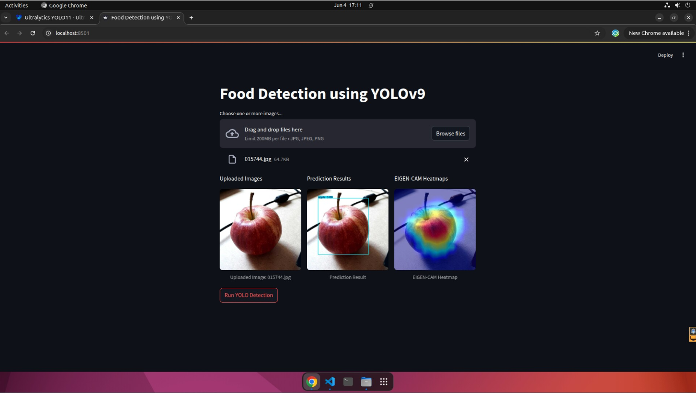

# food-benchmark-YOLOv9
food-benchmark-YOLOv9

# Streamlit installation and run app
```bash
# Install streamlit
pip install streamlit

# Run streamlit web app on local host
streamlit run app.py
```


# Dataset
### Accessing Dataset
The dataset used in this study is from myfoodrepo-273 Project "https://www.aicrowd.com/research/the-food-recognition-benchmark-using-deeplearning-to-recognize-food-on-images"


# Acknowledment
This work is supported by Bina Nusantara University as a part of Bina Nusantara University’s BINUS Research for Early Career Researchers entitled YoloV9 for Food Recognition Benchmark Dataset with contract number: 080/VRRTT/IV/2025 and contract date 25 April 2025.

The authors acknowledge the contributors of the dataset used in the myfoodrepo-273 study and Ultralytics team. This project uses code from **Ultralytics**. You can find more about Ultralytics at the following link: [Ultralytics Repository](https://github.com/ultralytics)
